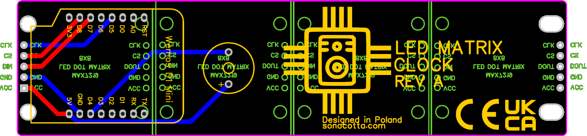
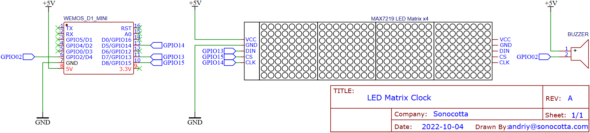

# ESP8266-LED-Matrix-Clock

## Firmware versions

| Firmware ver.              | Description        |
|----------------------------|--------------------|
| esp32-teams-status-monitor |                    |
| esp8266-game-of-life       |                    |
| esp8266-led-clock          | Clock              |

## Are required:
- 4 or 6 MAX7219 incl 8x LED-Matrix8x8
- one ESP8266 or ESP32 Board

<i>Define GPIOs, Brigthness and Timezones in the platformio.ini.</i>

Wifi credentials were recently replaced with [WiFiManager](https://github.com/tzapu/WiFiManager) - no hardcoded passwords anymore. When run for the first time (or no known networks present), configure via captive portal, then settings are saved and ESP will connect automatically.

Added support for ESP32-C3, tested on [Lolin C3 mini](https://www.wemos.cc/en/latest/c3/c3_mini.html) and works perfectly fine.

## Brief description:

During setup, the current time is obtained from an NTP via WLAN. If the clock is in operation, this process is repeated daily 

## Hardware

## Where to buy

Available as Kit on [Tindie](https://www.tindie.com/products/sonocotta/esp8266-led-matrix-clock-diy-kit/). Assembly instructions can be found [here](https://hackaday.io/project/188093/instructions)

